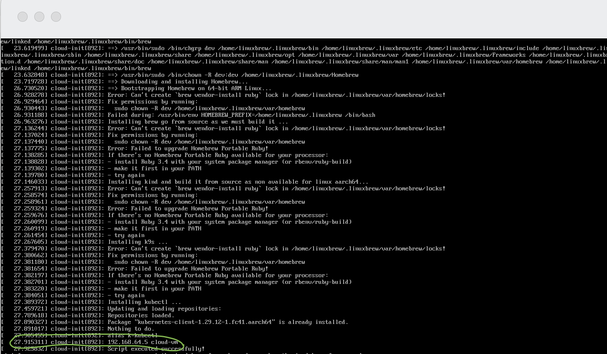

# How to create a VM on a mac machine using vfkit

The purpose of this project is to help you to create a VM on your Mac machine with the help of the [vfkit](https://github.com/crc-org/vfkit) command-line tool able to communicate with the [macOS Virtualization framework](https://developer.apple.com/documentation/virtualization).

The following VM have been successfully created:
- Fedora Cloud
- Fedora CoreOS
- MacOS
- Proxy the traffic to the VM using gvproxy to use as localhost

To create a VM, the only requirement is to install the vfkit command-line tool (>= 0.6.1)
```shell
brew install vfkit
```
Next, according to the VM that you would like to run, follow the instructions hereafter

## Cloud image and cloud-init

Download the compressed file matching your ARCH (x86 or ARM) and flavor `Fedora Cloud Base xx Raw` from the Fedora website: https://fedoraproject.org/cloud/download. 

Create next a cloud-init configuration file which includes the username, password, ssh key, etc. An example of such a configuration file is provided part of this project and can be customized: `./fedora/cloud-init/user-data.tpl`

You can define part of the section `packages:` the rpm that you would like to install using cloud-init. Nevertheless, when some additional steps are needed, it is then better
to create using the tag [write_files:](https://docs.cloud-init.io/en/latest/reference/yaml_examples/write_files.html) a bash script that cloud-init will execute post VM created.
The template of this project includes an example that you can customize as you want ;-)

```txt
write_files:
  - path: /run/scripts/install-script.sh
    permissions: '0755'
    content: |
      #!/bin/bash

      timedatectl set-timezone TIMEZONE

      mkdir -p /home/dev/.local/bin
      chown -R dev:dev /home/dev/.local

      echo "Install dev tools needed by brew"
      sudo dnf group install -y development-tools

      echo 'Installing homebrew ...' | sudo tee /run/install_log.txt
      CI=1 /bin/bash -c "$(curl -fsSL https://raw.githubusercontent.com/ZhongRuoyu/homebrew-aarch64-linux/HEAD/install.sh)"

      echo >> /home/dev/.bashrc
      echo 'eval "$(/home/linuxbrew/.linuxbrew/bin/brew shellenv)"' >> /home/dev/.bashrc
      eval "$(/home/linuxbrew/.linuxbrew/bin/brew shellenv)"

      echo 'Installing brew go from source as we must build it ...' | sudo tee /run/install_log.txt
      brew install --build-from-source go

      echo 'Installing kind and build it from source as non available for linux aarch64...' | sudo tee /run/install_log.txt
      brew install --build-from-source kind
      echo "export KIND_EXPERIMENTAL_FEATURE=podman" >> /home/dev/.bash_profile

      echo 'Installing k9s ...' | sudo tee /run/install_log.txt
      brew install derailed/k9s/k9s

      echo 'Installing kubectl ...' | sudo tee /run/install_log.txt
      sudo dnf install -y kubectl
      echo 'alias k=kubectl' | sudo tee /etc/profile.d/alias.sh

      echo "$(hostname -I | cut -d" " -f 1) $HOSTNAME" | sudo tee /etc/hosts

      echo 'Script executed successfully!' | sudo tee /run/install_log.txt

runcmd:
  - [ sudo, -u, dev, "/run/scripts/install-script.sh" ]
```

When you have finished to review and update the template file, execute the following script from a terminal to:
- Fetch (optional) and decompress the Fedora Cloud image, 
- Generate the crypted password for the `dev` user,
- Import your local public key from the `~/.ssh/id_rsa.pub` file,
- Generate the cloud-init `user-data` file

```bash
./script/cloud-init.sh fetch
```

When done, the folder `fedora/cloud-init/` will contain the generated `user-data` file and the image downloaded and uncompressed will be vailable under `./fedora/Fedora-cloud-<VERSION>.raw`.

Everything is in place to create using vfkit the VM except that to access the VM from your local machine, we must find the `mac address` of the eth or bridge interface that you plan to use to access the VM. 

You can get the MAC address of the interface within a terminal using the following mac command:
```shell
system_profiler SPNetworkDataType -json | jq -r '.SPNetworkDataType[] | select(.interface == "<<ETHERNET_INTERFACE>>") | .Ethernet."MAC Address"'
```

When done, you can create the VM using the following command:
```shell
export VIRT_FOLDER=/path/to/virt/dir

vfkit \
--cpus 2 \
--memory 2048 \
--log-level debug \
--cloud-init fedora/cloud-init/user-data \
--bootloader efi,variable-store=$VIRT_FOLDER/efi-variable-store,create \
--device virtio-blk,path=fedora/Fedora-Cloud-<<VERSION>>.raw \
--device virtio-input,keyboard \
--device virtio-input,pointing \
--device virtio-net,nat,mac=<<YOUR_MAC_ADDRESS>> \
--device rosetta,mountTag=rosetta,install \
--restful-uri tcp://localhost:60195 \
--device virtio-rng \
--device virtio-vsock,port=1025,socketURL=$VIRT_FOLDER/default.sock,listen \
--device virtio-serial,logFilePath=$VIRT_FOLDER/default.log \
--device virtio-gpu,width=800,height=600 \
--gui
```
or use the `start-vm.sh` bash script and set the following variables in an `.env` file:
```shell
touch .env
echo "RAW_FEDORA_FILE=Fedora-Cloud-42.raw
VM_MEMORY=4096
VM_CPU=2
MAC_ADDRESS=<YOUR_INTERFACE_MAC_ADDRESS>
" > .env
dotenv -x .env

./script/start-vm.sh 

where: 
- <RAW_FEDORA_FILE>: Fedora raw image
- <VM_MEMORY>: Memory size of the VM: 4096
- <VM_CPU>: Number of cpu: 2
- <MAC_ADRESS>: The eth mac adddress
- <SHARED_DIR>: /path/to/dir/to/share
```

To ssh, get the IP address of the VM from the GUI screen (see screenshot) and pass your private key



```shell
ssh -i ~/.ssh/id_rsa dev@<VM_IP_ADDRESS>
```

You can tail the file generated by cloud-init to check how the installation is going !
```bash
ssh -o StrictHostKeyChecking=no -o UserKnownHostsFile=/dev/null -i ~/.ssh/id_rsa dev@192.168.64.5 "sudo tail -f /var/log/cloud-init-output.log"

or

ssh -o StrictHostKeyChecking=no -o UserKnownHostsFile=/dev/null -i ~/.ssh/id_rsa dev@192.168.64.5
[dev@cloud-vm ~]$ sudo tail -f /var/log/cloud-init-output.log
...
Script executed successfully!
Cloud-init v. 24.2 finished at Tue, 08 Jul 2025 07:46:23 +0000. Datasource DataSourceNoCloud [seed=/dev/vdb][dsmode=net].  Up 27.97 seconds
```

You can also mount folders from your host machine as documented here: https://github.com/crc-org/vfkit/blob/main/doc/usage.md#file-sharing
by using the following parameter 
```shell
--device virtio-fs,sharedDir=<<YOUR_PATH>>,mountTag=<<MOUNT_NAME>> \
```
and ssh to mount the dir
```bash
ssh -i ~/.ssh/id_rsa user1@192.168.64.5
user1@localhost:~$ pwd
/home/dev

mkdir /home/dev/host_dir
sudo mount -t virtiofs <<MOUNT_NAME>> /home/dev/<<TARGET_DIR>>
ls -la /home/dev/<<TARGET_DIR>>
[dev@localhost ~]$ ls -la /home/dev/host_dir/
total 20
drwxr-xr-x 33 dev dev  1056 Jul  1 16:21 .
drwxr-xr-x 42 dev dev  1344 Jul  8 05:33 ch007m
drwxr-xr-x  5 dev dev   160 Dec 10  2024 cmoulliard
drwxr-xr-x  9 dev dev   288 Feb  6 16:39 cncf
...
```

## MacOS VM

Under active development !!

```shell
# Execute the following commands from a MacBook machine
git clone https://github.com/Code-Hex/vz.git && cd vz
cd example/macOS/
make build

./virtualization -install
download restore image in "/Users/cmoullia/VM.bundle/RestoreImage.ipsw"
download has been completed
install has been completed

# When done use the following vfkit command
set IMG /Users/cmoullia/VM.bundle/Disk.img
set VM_BUNDLE /Users/cmoullia/VM.bundle
set VIRT_FOLDER _virt
set MAC_ADDRESS $(system_profiler SPNetworkDataType -json | jq -r '.SPNetworkDataType[] | select(.interface == "en8") | .Ethernet."MAC Address"')

vfkit \
--cpus 2 \
--memory 2048 \
--log-level debug \
--bootloader macos,machineIdentifierPath=$VM_BUNDLE/MachineIdentifier,hardwareModelPath=$VM_BUNDLE/HardwareModel,auxImagePath=$VM_BUNDLE/AuxiliaryStorage \
--device virtio-blk,path=$IMG \
--device virtio-input,keyboard \
--device virtio-input,pointing \
--device virtio-net,nat,mac=$MAC_ADDRESS \
--device rosetta,mountTag=rosetta,install \
--restful-uri tcp://localhost:60195 \
--device virtio-rng \
--device virtio-vsock,port=1025,socketURL=$VIRT_FOLDER/default.sock,listen \
--device virtio-serial,logFilePath=$VIRT_FOLDER/default.log \
--device virtio-gpu,width=800,height=600 \
--gui
```
The GUI will start and then follow the instructions to customize your Mac environment: country/region, language, user account & password, etc
To ssh enable the `Remote Login` as documented https://osxdaily.com/2022/07/08/turn-on-ssh-mac/ and next you ssh
```shell
ssh <mac_account>@<IP>
ssh -o StrictHostKeyChecking=no -o UserKnownHostsFile=/dev/null dabou@192.168.64.5
❯ ssh -o StrictHostKeyChecking=no -o UserKnownHostsFile=/dev/null dabou@192.168.64.5
Warning: Permanently added '192.168.64.5' (ED25519) to the list of known hosts.
(dabou@192.168.64.5) Password:
Last login: Tue Jul  8 17:28:25 2025 from 192.168.64.1
dabou@dabous-Virtual-Machine ~ % ls -la
total 16
drwxr-x---+ 14 dabou  staff   448 Jul  8 17:43 .
drwxr-xr-x   5 root   admin   160 Jul  8 17:06 ..
-r--------   1 dabou  staff     7 Jul  8 17:06 .CFUserTextEncoding
drwx------+  2 dabou  staff    64 Jul  8 17:08 .Trash
-rw-------   1 dabou  staff    39 Jul  8 17:28 .zsh_history
drwx------   3 dabou  staff    96 Jul  8 17:09 .zsh_sessions
drwx------+  3 dabou  staff    96 Jul  8 17:06 Desktop
drwx------+  3 dabou  staff    96 Jul  8 17:06 Documents
drwx------+  3 dabou  staff    96 Jul  8 17:06 Downloads
drwx------@ 75 dabou  staff  2400 Jul  8 17:18 Library
drwx------   3 dabou  staff    96 Jul  8 17:06 Movies
drwx------+  3 dabou  staff    96 Jul  8 17:06 Music
drwx------+  4 dabou  staff   128 Jul  8 17:06 Pictures
drwxr-xr-x+  4 dabou  staff   128 Jul  8 17:06 Public
```

## CoreOS image

**NOTE**: There is a limitation using the CoreOS image as by nature the `bootc system` is configured to be read-only, and by consequence it will not be possible to install packages using dnf. 
We can nevertheless install some packages using the command `sudo rpm-ostree install` but a reboot of the VM is needed or as an alternative you can run within the VM a container !

Download a Fedora CoreOS AppleHV image from the Fedora project: https://fedoraproject.org/coreos/download?stream=stable#baremetal and extract it locally.

Create a [butane](https://coreos.github.io/butane/) yaml config file to define a user, its password and import your public key (to ssh). See hereafter what you should do !
```bash
cat <<'EOF' > _virt/my-cfg.bu
variant: fcos
version: 1.1.0
passwd:
  users:
    - name: dev
      # 
      # Get your RSA or ed25519 Public key and append it to the following field:
      # cat ~/.ssh/id_rsa.pub
      #
      ssh_authorized_keys:
      - <<ADD_HERE THE CONTENT OF YOUR PUBLIC KEY STRING>>
      #
      # !! Generate the hash password using this command: 
      # podman run -ti --rm quay.io/coreos/mkpasswd --method=yescrypt dev
      #
      password_hash: <<GENERATED_PASSWORD>>
      home_dir: /home/dev
      no_create_home: false
      groups:
        - wheel
        - sudo
      shell: /bin/bash
EOF
```
and convert it to an ignition json file using `butane` tool

```bash
export CFG_FOLDER=$(pwd)/_virt

podman run --rm \
  -v $CFG_FOLDER/:/files \
  quay.io/coreos/butane:release \
  --pretty \
  --strict \
  /files/my-cfg.bu > $CFG_FOLDER/transpiled_config.ign
cp $CFG_FOLDER/transpiled_config.ign $CFG_FOLDER/my-cfg.ign
```

To access the VM from your local machine, it is needed to pass using the parameter `--device virtio-net,nat,mac` the mac address of your eth or bridge interface.

You can get the MAC address from a terminal using the following command:
```shell
system_profiler SPNetworkDataType -json | jq -r '.SPNetworkDataType[] | select(.interface == "en8") | .Ethernet."MAC Address"'
```

**NOTE**: See the documentation page [network interface](https://github.com/crc-org/vfkit/blob/main/doc/usage.md#networking)

Create now the VM
```bash
export IMG=fedora-coreos-42.20250623.3.0-applehv.aarch64.raw

vfkit \
--cpus 2 \
--memory 2048 \
--log-level debug \
--ignition $CFG_FOLDER/my-cfg.ign \
--bootloader efi,variable-store=$CFG_FOLDER/efi-variable-store,create \
--device virtio-blk,path=$IMG \
--device virtio-input,keyboard \
--device virtio-input,pointing \
--device virtio-net,nat,mac=<<YOUR_MAC_ADDRESS>> \
--device rosetta,mountTag=rosetta,install \
--restful-uri tcp://localhost:60195 \
--device virtio-rng \
--device virtio-vsock,port=1025,socketURL=$CFG_FOLDER/default.sock,listen \
--device virtio-serial,logFilePath=$CFG_FOLDER/default.log \
--device virtio-gpu,width=800,height=600 \
--gui
```
or use the bash script:
```shell
touch .env
echo "RAW_COREOS_FEDORA_FILE=fedora-coreos-42.20250623.3.0-applehv.aarch64.raw
VM_MEMORY=4096
CPU=2
MAC_ADDRESS=<YOUR_INTERFACE_MAC_ADDRESS>
" > .env
dotenv -x .env

./script/start-vm.sh 

where: 
- <RAW_FEDORA_FILE>: Fedora CoreOS raw image for applehv & aarch64
- <IGNITION>: true
- <VM_MEMORY>: 4096
- <VM_CPU>: 2
- <MAC_ADRESS>: 
- <SHARED_DIR>: /path/to/dir/to/share
```

To ssh, get the IP address of the VM from the GUI screen and pass your private key
```bash
ssh -i ~/.ssh/id_rsa dev@192.168.64.5
Fedora CoreOS 41.20241215.3.0
Tracker: https://github.com/coreos/fedora-coreos-tracker
Discuss: https://discussion.fedoraproject.org/tag/coreos

Last login: Fri Jan 10 13:14:45 2025 from 192.168.64.1
dev@localhost:~$ 
```

## Proxy the traffic to use localhost with the help of gvproxy

To ssh to the VM using `localhost` and without the need to be worry about the IP address assigned to the VM, it is needed to use the [gVisor](https://github.com/containers/gvisor-tap-vsock) tool, acting as proxy and been able `dynamically port forward` the packets.

If you have installed podman, then the tool is already installed, otherwise install it using the latest release: https://github.com/containers/gvisor-tap-vsock/releases
Execute the following command where you define the `ssh-port` where the traffic will be forwarded. Take care also to pass the user `dev` and your private key to the `gvproxy` command

```bash
set VIRT_FOLDER path/to/_virt
rm $VIRT_FOLDER/gvproxy.sock

gvproxy -debug -mtu 1500 -ssh-port 60188 \
  -listen-vfkit unixgram://$VIRT_FOLDER/gvproxy.sock \
  -forward-dest /run/user/501/podman/podman.sock \
  -forward-user dev \
  -forward-identity $HOME/.ssh/id_rsa \
  -forward-sock $VIRT_FOLDER/vm.sock \
  -pid-file $VIRT_FOLDER/gvproxy.pid \
  -log-file $VIRT_FOLDER/gvproxy.log
```

Next, review the parameters of the previous `vfkit` command used and change the `virtio-net` device to use now a `unixSocketPath` pointing to the `gvproxy.sock` file and use as mac address the one expected `5a:94:ef:e4:0c:ee` by gvproxy for the IP: `192.168.127.2`.
```txt
 --device virtio-net,unixSocketPath=$VIRT_FOLDER/gvproxy.sock,mac=5a:94:ef:e4:0c:ee \
```
Such a mac address will be used by the gvproxy tool to send packets
```shell
I0708 15:52:11.490427   92298 sniffer.go:241] send arp 192.168.127.1 (5a:94:ef:e4:0c:dd) -> 192.168.127.2 (00:00:00:00:00:00) valid:true
...
```
Execute this command to create the VM
```shell
vfkit \
 --cpus 2 \
 --memory 2048 \
 --log-level debug \
 --cloud-init fedora/cloud-init/user-data \
 --bootloader efi,variable-store=$VIRT_FOLDER/efi-variable-store,create \
 --device virtio-blk,path=fedora/Fedora-Cloud-42.raw \
 --device virtio-rng \
 --device virtio-serial,logFilePath=$VIRT_FOLDER/default.log \
 --device rosetta,mountTag=rosetta,install \
 --device virtio-vsock,port=1025,socketURL=$VIRT_FOLDER/default.sock,listen \
 --device virtio-net,unixSocketPath=$VIRT_FOLDER/gvproxy.sock,mac=5a:94:ef:e4:0c:ee \
 --restful-uri tcp://localhost:60195 \
 --device virtio-input,keyboard \
 --device virtio-input,pointing \
 --device virtio-gpu,width=800,height=600 \
 --gui
```

To ssh, use this command and port where traffic is forwarded by gvproxy !
```bash
ssh -i /Users/cmoullia/.ssh/id_rsa -p 60188 dev@localhost

Warning: Permanently added '[localhost]:60188' (ED25519) to the list of known hosts.
Last login: Tue Jul  8 13:29:53 2025 from 192.168.64.1
```
